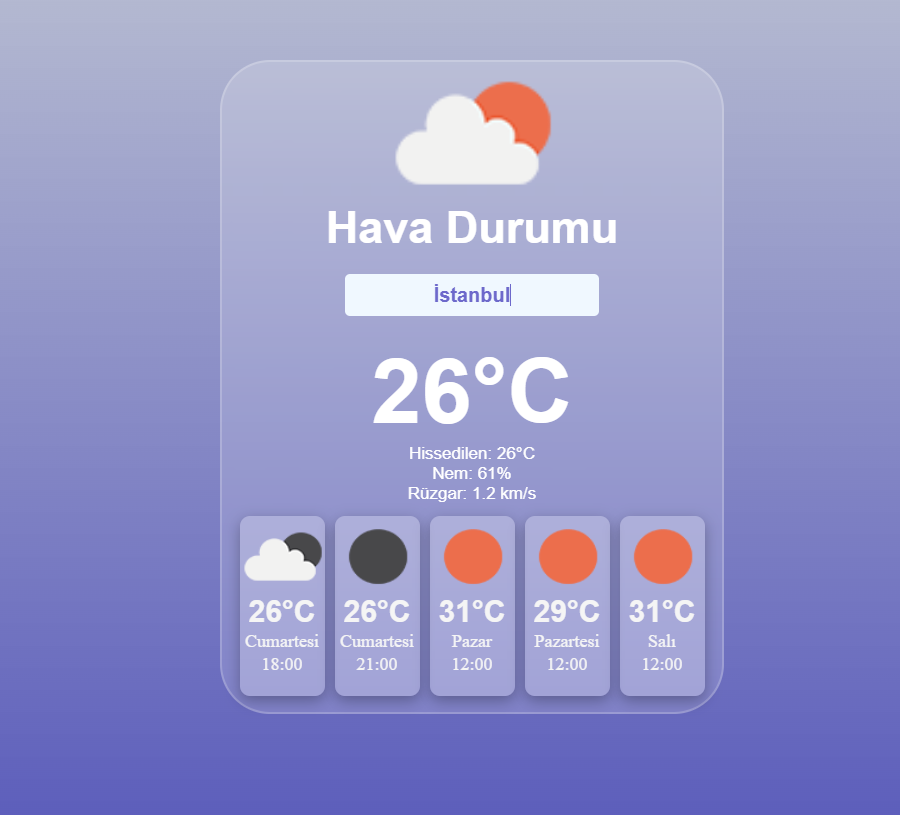

# 🌤️ Weather Forecast App

A simple weather forecast application built with **React** and the **OpenWeather API**.  
It shows the current weather, upcoming hours, and a 5-day forecast.

---

## 🚀 Features

- 🌡️ Current weather information
- ⏱️ Next 2 forecasts (approx. 3h and 6h ahead)
- 📅 4-day forecast (daily data at 12:00)
- ☁️ Weather icons from OpenWeather
- 🎨 Simple responsive UI with CSS

---
## 👀 App Views

  
  

